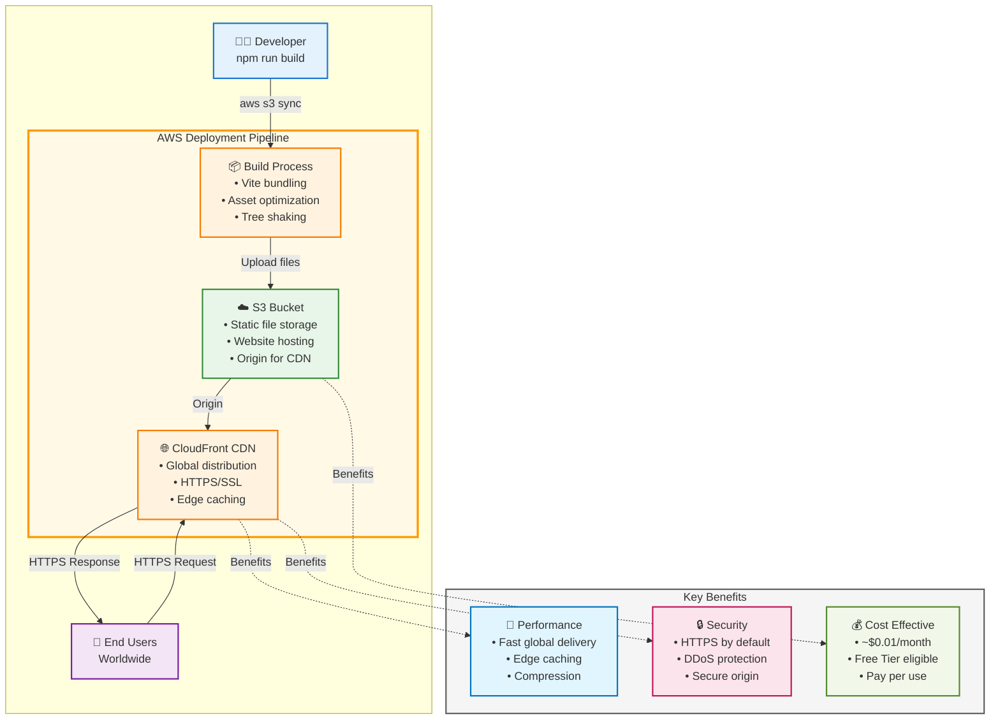

# Doable

A modern, responsive to-do list application built with React, TypeScript, and Tailwind CSS.

**"Anything is doable!"** - A simple yet powerful task management app that helps you get things done.

## Technology Stack

- **Node.js**: v20.19.5 (LTS)
- **React**: v18.3.1
- **TypeScript**: v5.9.3
- **Vite**: v7.1.7
- **Tailwind CSS**: v3.4.18 (stable)
- **Jest**: v30.2.0
- **React Testing Library**: v16.3.0
- **Storybook**: v9.1.10
- **ESLint**: v9.36.0
- **Prettier**: v3.6.2

> **Note:** Initially planned to use Tailwind v4, but downgraded to v3 for better compatibility with Vite and PostCSS. See [CSS Versioning Lessons](docs/knowledge-transfer/architecture/css-versioning-compatibility-lessons.md) for details.

## Prerequisites

- Node.js v20.19.5 or higher
- npm v10.8.2 or higher
- [nvm](https://github.com/nvm-sh/nvm) (recommended for automatic version switching)

## Getting Started

### Automatic Node Version Switching (Recommended)

This project includes automatic Node.js version switching via `.nvmrc`.

**🚀 Quick Setup (Automated)**

```bash
# Run the automated setup script (detects your OS and configures everything)
bash scripts/setup-node-version-manager.sh
```

This script will:

- ✅ Detect your operating system (Ubuntu, macOS, Fedora, Arch, etc.)
- ✅ Install direnv if not present (with your permission)
- ✅ Configure your shell (.bashrc, .zshrc, etc.)
- ✅ Allow direnv for this project
- ✅ Verify nvm and Node.js installation
- ✅ Safe to run multiple times (idempotent)

**Manual Setup Options**

If you prefer manual setup, see [docs/knowledge-transfer/setup/node-version-setup.md](docs/knowledge-transfer/setup/node-version-setup.md) for detailed instructions including:

- Per-session manual loading
- direnv manual installation
- Standard nvm usage
- Troubleshooting guide

### Installation

```bash
npm install
```

### Development

```bash
npm run dev
```

### Build

```bash
npm run build
```

### Preview Production Build

```bash
npm run preview
```

## Testing

### Run Tests

```bash
npm test
```

### Run Tests in Watch Mode

```bash
npm run test:watch
```

### Generate Coverage Report

```bash
npm run test:coverage
```

## Code Quality

### Linting

```bash
npm run lint
```

### Format Code

```bash
npm run format
```

### Check Formatting

```bash
npm run format:check
```

## Storybook

### Run Storybook

```bash
npm run storybook
```

### Build Storybook

```bash
npm run build-storybook
```

## Project Structure

```
src/
├── components/       # React components
├── hooks/           # Custom React hooks
├── types/           # TypeScript type definitions
├── utils/           # Utility functions
├── stories/         # Storybook stories
├── App.tsx          # Root application component
├── main.tsx         # Application entry point
└── index.css        # Global styles with Tailwind
```

## Features

### Core Functionality

- ✅ **Create** todos with validation (no empty todos)
- ✅ **Read** todos with automatic loading from localStorage
- ✅ **Update** todos with inline editing (double-click to edit)
- ✅ **Delete** todos with immediate removal
- ✅ **Toggle** completion status with visual feedback
- ✅ **Persist** data automatically in localStorage

### User Experience

- 🎨 **Modern UI** with Tailwind CSS and smooth animations
- 🎯 **Custom Brand Icon** - Checkmark icon representing task completion
- 📱 **Responsive Design** optimized for mobile and desktop
- ⌨️ **Keyboard Navigation** - full keyboard support (Enter, Escape, Tab)
- ♿ **Accessibility** - WCAG AA compliant with ARIA labels
- 🎭 **Smooth Animations** for adding, editing, and deleting todos
- 🌈 **Visual Feedback** for all user actions
- 🔗 **Interactive Header** - Clickable brand logo and title

### Error Handling

- 🛡️ **Graceful Degradation** - app works even when localStorage fails
- 💾 **Data Persistence** with automatic error recovery
- 📢 **Clear Error Messages** with dismissible notifications
- 🔄 **Automatic Recovery** from transient storage errors
- ⚠️ **Validation Feedback** with accessible error messages

### Technical Highlights

- 🧪 **131 Tests** with 100% passing rate (8 test suites)
- 📚 **Storybook** ready for component documentation
- 🔒 **Type Safety** with TypeScript throughout
- 🚀 **Fast Performance** with optimized React rendering
- 📦 **Small Bundle** (~500KB) with tree-shaking and code splitting
- ♿ **WCAG AA Compliant** with comprehensive accessibility features
- 🎨 **Tricolor Design System** (blue, yellow, orange) for intuitive UX
- 🎨 **Custom SVG Icons** with vite-plugin-svgr integration
- 🔧 **Robust Git Hooks** with automated pre-commit checks

## Contributing

### Commit Message Convention

This project follows [Conventional Commits](https://www.conventionalcommits.org/) specification.

**Format:** `type(scope): subject`

**Examples:**

```bash
feat(hooks): Add commit message validation
fix: Resolve Node version switching issue
docs(api): Update authentication guide
```

See [docs/knowledge-transfer/development-process/commit-message-convention.md](docs/knowledge-transfer/development-process/commit-message-convention.md) for detailed guidelines.

**Commit messages are automatically validated** by a commit-msg hook. Invalid messages will be rejected with helpful guidance.

## Documentation

### 📚 Comprehensive Knowledge Base

This project includes extensive documentation covering all aspects of development:

**Quick Links:**

- **[Project Overview](docs/knowledge-transfer/architecture/project-completion-summary.md)** - Complete project summary
- **[Color Palette](docs/knowledge-transfer/architecture/color-palette.md)** - Design system documentation
- **[CSS Architecture](docs/knowledge-transfer/architecture/scalable-css-architecture-recommendations.md)** - Scaling strategies
- **[Custom SVG Icons](docs/knowledge-transfer/development-process/custom-svg-icon-implementation.md)** - Icon implementation guide
- **[AWS Deployment](docs/knowledge-transfer/deployment/aws-deployment-options-frontend.md)** - Production deployment guide
- **[All Documentation](docs/knowledge-transfer/README.md)** - Complete documentation index

**Documentation Categories:**

- 🏗️ **Architecture** - Design decisions, CSS, accessibility
- 🚀 **Deployment** - AWS hosting options and guides
- 💻 **Development Process** - Git conventions, workflows, SVG icons
- ⚙️ **Setup** - Configuration and tools
- ✅ **Tasks** - Feature implementation docs
- 🧪 **Testing** - TDD strategy and practices
- 🔧 **Troubleshooting** - Problem-solving guides, Git hooks, Jest fixes

## Deployment

### Architecture Overview

**Live Site:** [https://d3oisvzydii1gm.cloudfront.net](https://d3oisvzydii1gm.cloudfront.net)



**Deployment Flow:**

1. **Developer** runs `npm run build` to create production bundle
2. **Build Process** optimizes assets with Vite (bundling, tree-shaking, minification)
3. **Upload** to S3 bucket using `aws s3 sync dist/ s3://doable.io --delete`
4. **S3** stores static files and serves as origin for CloudFront
5. **CloudFront** distributes content globally with edge caching and HTTPS
6. **Users** access the app via CloudFront URL with fast, secure delivery

### Production Deployment Options

**Recommended: AWS S3 + CloudFront**

- Cost: ~$1-10/month
- Global CDN performance
- HTTPS by default
- Easy CI/CD integration

See [AWS Deployment Options](docs/knowledge-transfer/deployment/aws-deployment-options-frontend.md) for complete guide with:

- Step-by-step implementation
- Cost comparisons
- Security best practices
- Infrastructure as Code examples

## License

MIT
